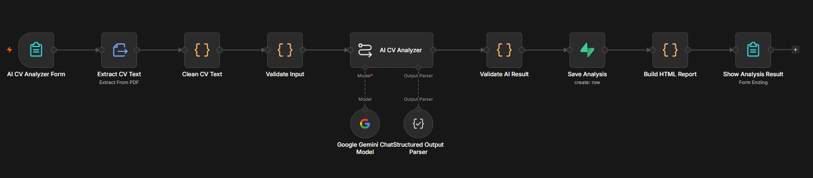
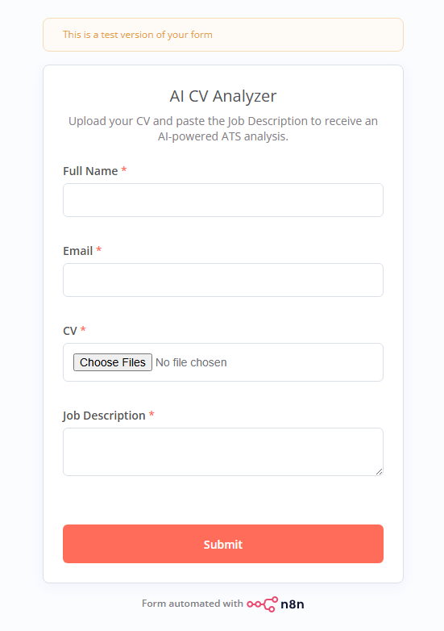
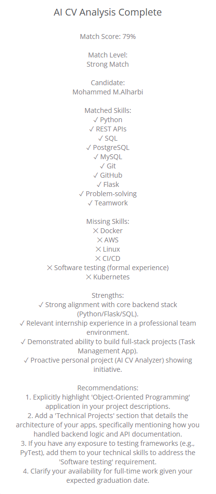
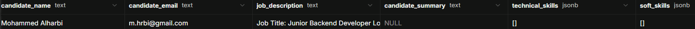

# AI CV Analyzer

An AI-powered CV analyzer built with **n8n**, **Google Gemini**, and **Supabase**.

The workflow allows users to upload a CV and paste a Job Description. It then analyzes the resume, compares it with the job requirements, identifies missing skills, and calculates a Match Score.

---

## Features

- Upload CV in PDF format
- Extract CV text automatically
- Analyze technical and soft skills
- Analyze experience and education
- Compare CV with Job Description
- Detect matched skills
- Detect missing skills
- Generate recommendations
- Calculate Match Score from 0–100
- Store results in Supabase
- Display the analysis result

---

## Workflow



---

## Upload Form

Users enter their information, upload a CV, and paste the Job Description.



---

## Analysis Result

The workflow displays:

- Match Score
- Match Level
- Matched Skills
- Missing Skills
- Strengths
- Recommendations



---

## Supabase

The analysis results are stored in Supabase.



---

## Tech Stack

- n8n
- Google Gemini
- Supabase
- PostgreSQL
- JavaScript
- HTML
- JSON

---

## Workflow Structure

```text
AI CV Analyzer Form
        ↓
Extract CV Text
        ↓
Clean CV Text
        ↓
Validate Input
        ↓
AI CV Analyzer
   ↙             ↘
Gemini      Structured Output
        ↓
Validate AI Result
        ↓
Save Analysis
        ↓
Build HTML Report
        ↓
Show Analysis Result
```

---

# 🧠 What I Learned

This project demonstrates experience with:

- AI workflow automation
- n8n workflow development
- LLM integration
- Prompt engineering
- Structured AI output
- JSON Schema
- PDF processing
- JavaScript data processing
- Input validation
- API credentials management
- Supabase integration
- PostgreSQL
- Database design
- AI result validation
- ATS-style scoring logic

---

# 📌 Project Status

```text
Status: Development / Prototype
```

Current functionality includes:

- CV upload
- PDF extraction
- AI analysis
- Structured output
- Job Description comparison
- Match scoring
- Supabase integration
- Result display

Additional improvements are planned.

---

# 👨‍💻 Author

**Mohammed Alharbi**

Computer Science Student

Interests:

- Artificial Intelligence
- AI Automation
- Software Engineering
- Web Development
- Workflow Automation

---
